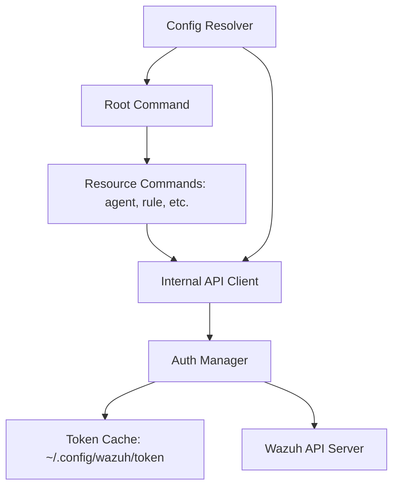

# Architecture Overview

`wazuh-cli` is designed as a production-grade, non-interactive command-line interface for the Wazuh API, optimized for both human developers and autonomous AI agents.

## Design Philosophy

- **Zero Interactivity**: All commands (except `init` and `auth login`) are strictly flag-driven. This ensures compatibility with automated orchestration and headless environments.
- **Machine-First Output**: JSON is the default output format, ensuring that results can be easily parsed by `jq` or LLM tools.
- **Security by Design**: 
  - Configuration and token files are created with `0600` permissions.
  - Sensitive data (passwords) is masked in debug logs and `config list` output.
  - Multi-method authentication fallbacks ensure connectivity across different server versions.

## Component Structure

### Internal Packages

- `cmd/`: Command definitions using `spf13/cobra`. Handles flag parsing and output formatting.
- `internal/config/`: Hierarchical configuration resolution (CLI > Env > .env > JSON).
- `internal/client/`: Wazuh-specific HTTP client wrapper.
- `internal/output/`: Standardized JSON/Markdown/Raw output handlers and exit code mapping.

## AI Agent Integration

The CLI includes a built-in `skill/SKILL.md` that defines the tool's interface for AI agents. This allows agents to:
1. Understand the command hierarchy.
2. Resolve authentication requirements automatically.
3. Parse structured JSON responses for downstream tasks.
